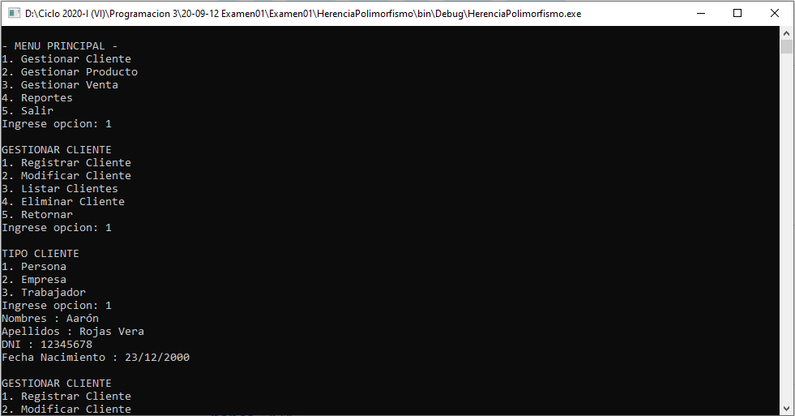
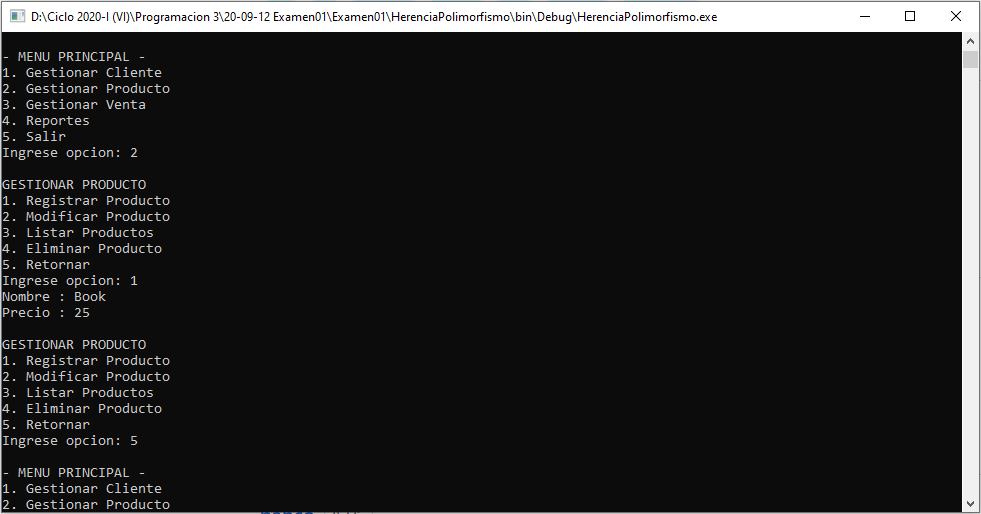
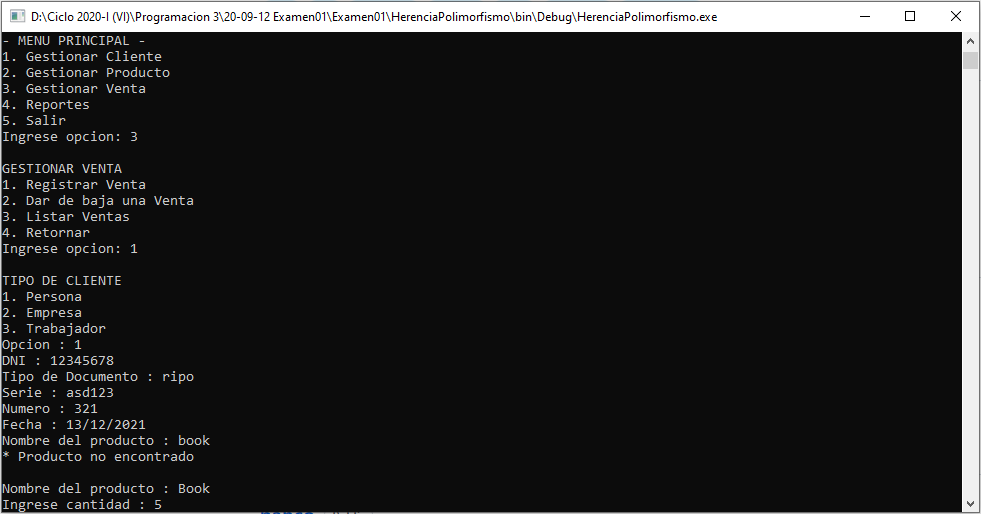
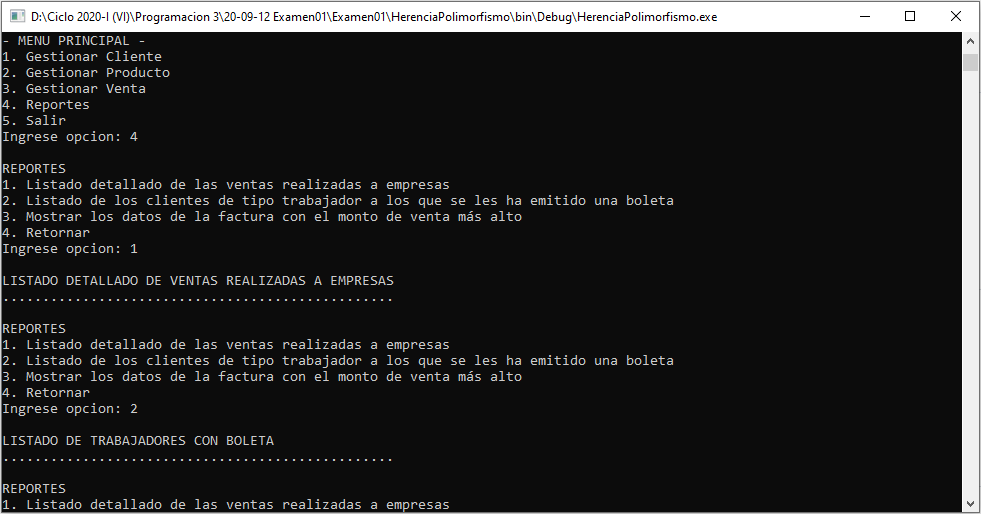

# Gestión de tienda v2
Sistema de gestión de una tienda que permite gestionar cliente que permite registrar, modificar, listar y eliminar clientes, también gestionar producto que permite registrar, modificar, listar y eliminar productos, también gestionar venta que permite registrar, dar de baja y listar  las ventas y reportes donde tenemos listado de las ventas realizadas a empresas, listado de los clientes de tipo trabajador a los que se les ha emitido una boleta y mostrar los datos de la factura con el monto de venta más alto, **12/09/20**

<strong>Imagen:</strong> Menú gestionar cliente - Registrar cliente.

<strong>Imagen:</strong> Menú gestionar producto - Registrar producto.

<strong>Imagen:</strong> Menú gestionar venta - Registrar venta.

<strong>Imagen:</strong> Menú reportes.

